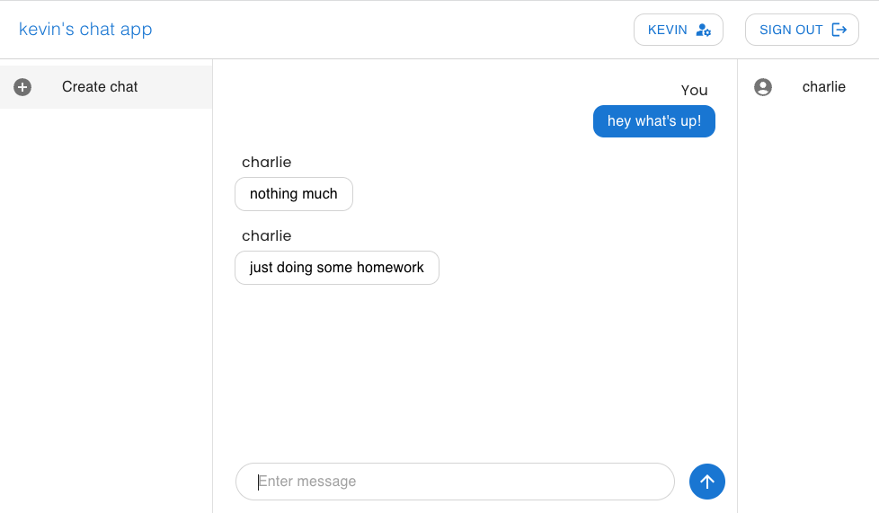
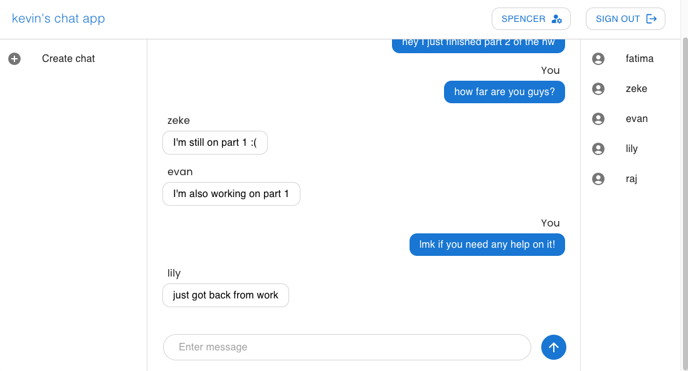
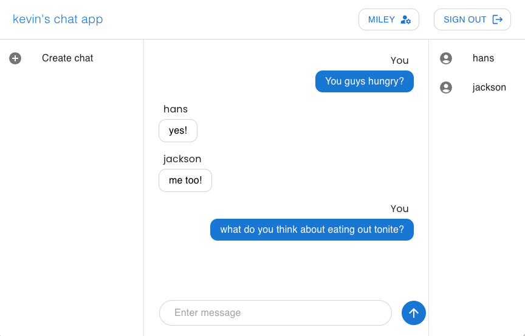
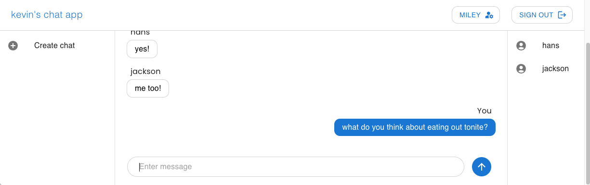
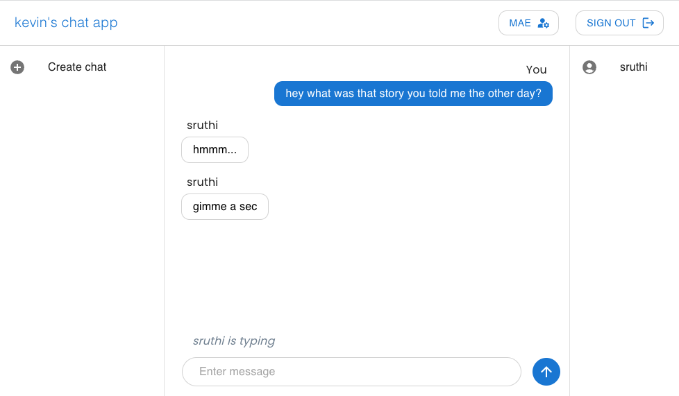
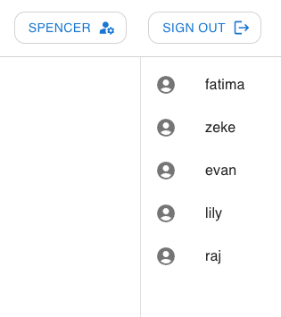

# kevin's chat app

Adapted from [Building a chat app with Socket.io and React 🚀](https://dev.to/novu/building-a-chat-app-with-socketio-and-react-2edj) tutorial

## Features

### Chat
- Chat with your friends!

    |  |
    |-|

- Participate in group chats with multiple users at once

    |  |
    |-|

### Dynamic resizing
- On-screen elements dynamically re-adjust to maintain a cohesive UI

    |  |
    |-|

    |  |
    |-|

### Typing status indicator
- Live typing status indicator to show that
another user is currently writing a message

    |  |
    |-|

### Display currently active users
- See the users who are logged in right now on the sidebar to the right

    |  |
    |-|

### Chats saved between logins
- Users will be able to view previous messages if they join later
- Messages persist between logins &mdash; 
letting users who leave and rejoin continue where they left off

### Material Design
- Clean design that follows Google's [Material Design](#mui-material-ui) through the use of MUI

### [Client-server model](https://en.wikipedia.org/wiki/Client%E2%80%93server_model)

- Clients connect to a server which handles communication between clients
- Server keeps track of users, chats, and messages which allows users
to continue where they left off when they rejoin

## Front-end

### [React.js](https://reactjs.org/)

- Provides framework for building user interfaces
- Serve dynamic content without reloading the whole page for every change

### [MUI (Material UI)](https://mui.com/)

- A third-party React.js component library
- Add custom React.js components that follow Google's
[Material Design](https://m3.material.io/) principles

## Back-end

### [Express.js](https://expressjs.com/)

- General web application framework for structuring the app

### [Socket.IO](https://socket.io/)

- Handles connections between client and server
- Better performance than simply using back-and-forth HTTP requests